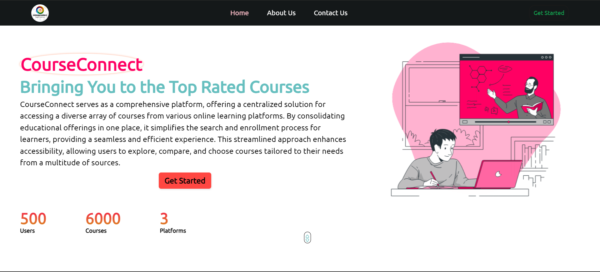
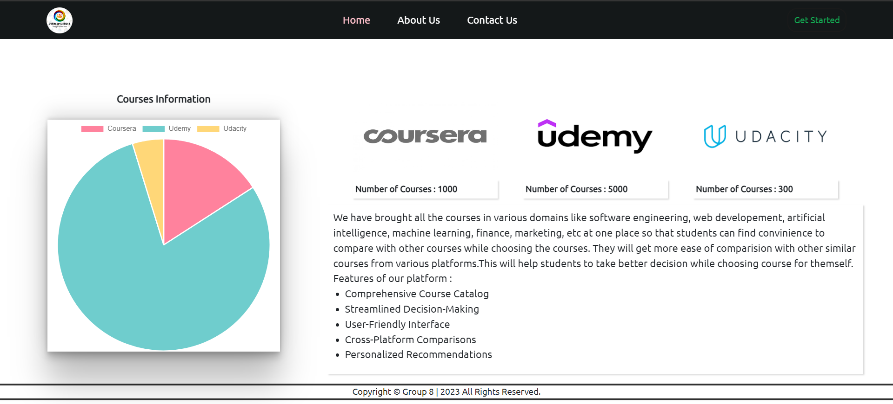
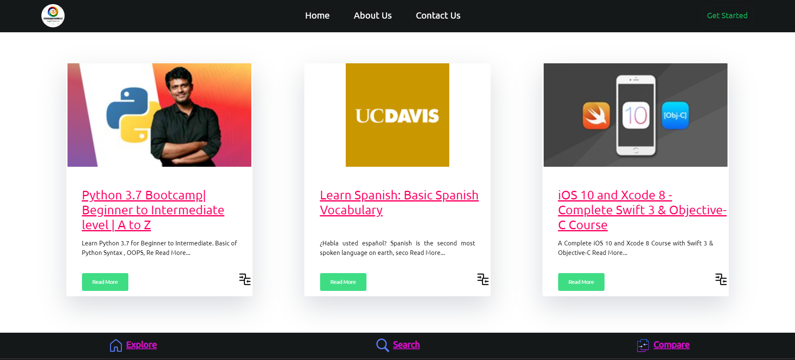
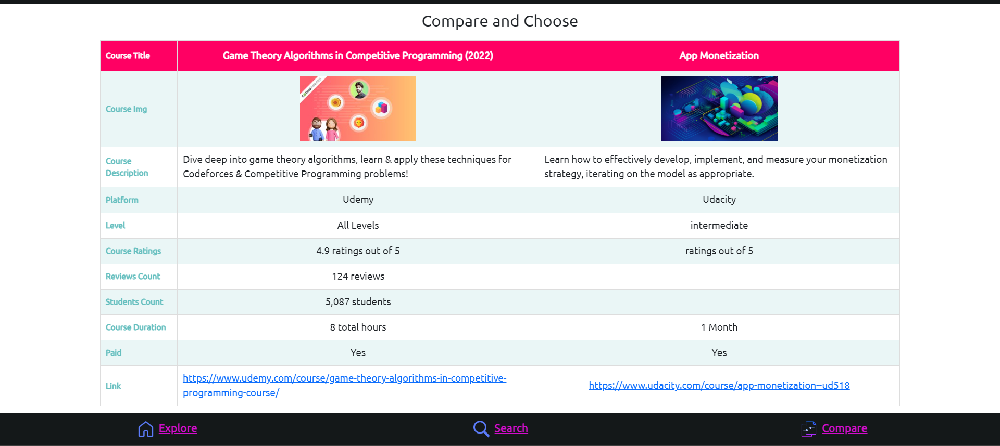
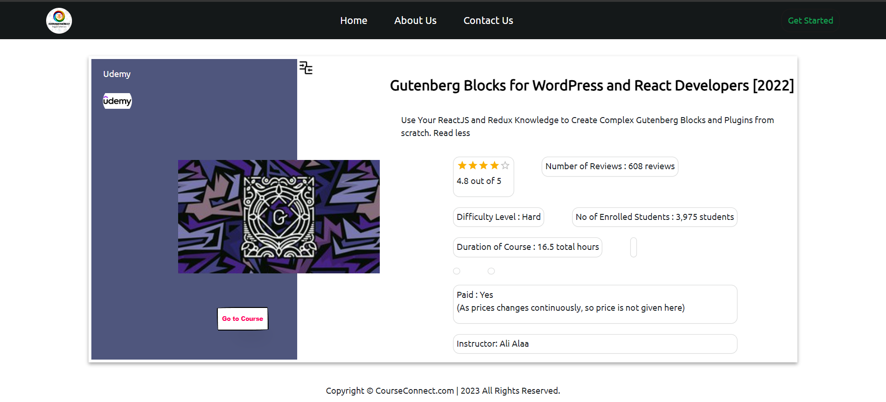
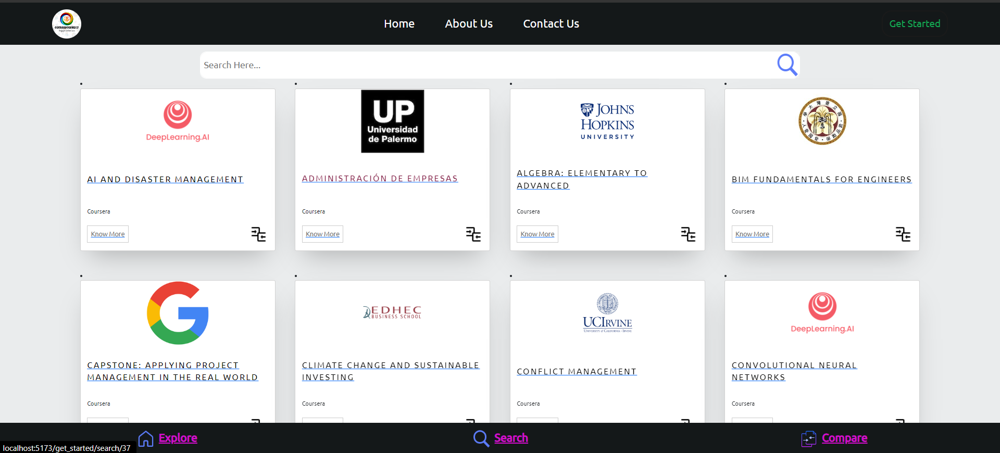
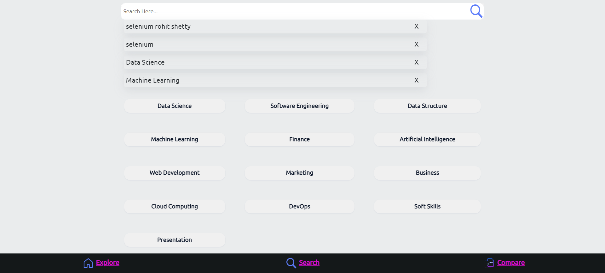

# CourseConnect - A Course Recommendation System

Welcome to CourseConnect - where technology meets education to revolutionize your learning journey! 🚀📚

CourseConnect is a powerful course recommendation system built using the MERN (MongoDB, Express.js, React.js, Node.js) stack, along with machine learning and deep learning models powered by FastAPI. This project aims to provide users with personalized course recommendations based on their skills, preferences, and learning patterns. Whether you're a student looking for the perfect course or an enthusiast eager to expand your knowledge, CourseConnect is your gateway to an enriched learning experience.

## Key Features

- **MERN Stack:** Leveraging the full potential of the MERN stack for a seamless and responsive web application.

- **Machine Learning & Deep Learning:** Employing state-of-the-art ML and DL models to analyze user behavior and preferences for accurate course recommendations.

- **FastAPI Integration:** Utilizing FastAPI to enhance the efficiency and speed of handling backend processes.

- **User Profiles:** Creating personalized user profiles to fine-tune recommendations based on individual learning goals.

-  ## Screenshots
- 

- 

- 

- 

- 

- 

- 

## Technologies Used

- **MongoDB:** Database for storing user profiles, course data, and learning patterns.
- **Express.js:** Backend framework for handling server-side operations.
- **React.js:** Frontend library for building a dynamic and interactive user interface.
- **Node.js:** Server-side JavaScript runtime for building scalable and high-performance applications.
- **FastAPI:** Fast and modern web framework for building APIs with Python 3.7+.

## Contribution

Contributions are welcome! If you'd like to enhance CourseConnect, add new features, or suggest improvements, feel free to open a pull request or submit an issue.
